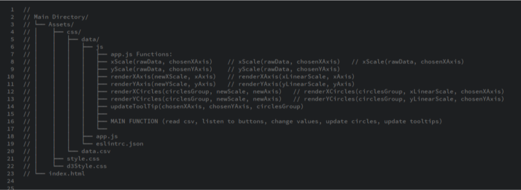
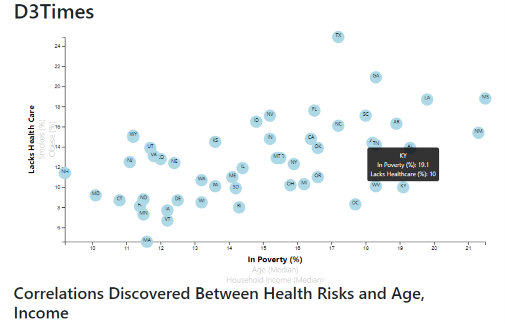

# Interactive d3.JavaScript Scatter Plot

## Objective
Create an interactive scatter plot using html, d3.js, and a CSV file.
Enable a user to select new X and Y axis labels to immediately change the dataset.
Include animation of the plots moving and tooltips to provide additional information to the user.

#### Note:
In order to view the scatter plot locally, you will need to either run it on a local server `python -m http.server` or with a text editor (such as Brackets) that can render the d3.js.

